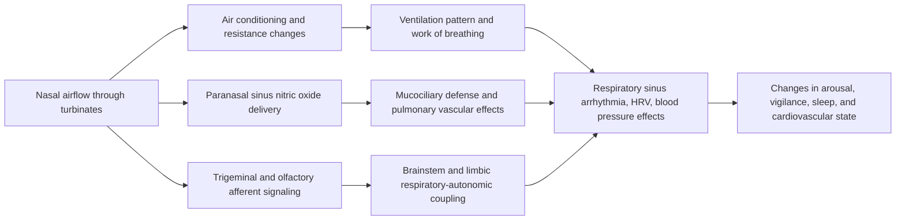
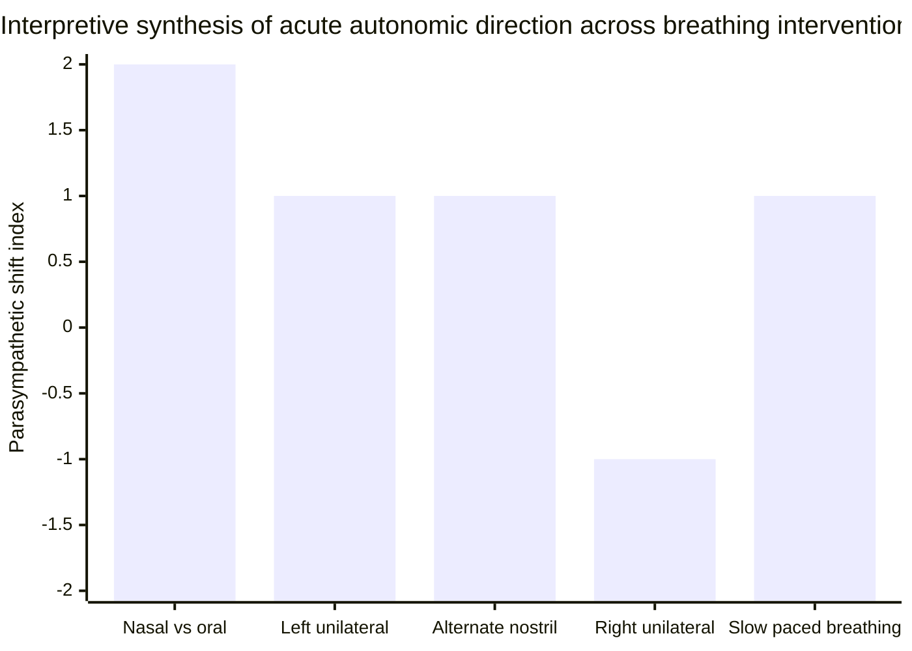

<!--
PROVENANCE: This report was generated by an external AI "deep research" engine
and supplied by the app owner. Its inline citations (turnNsearchM) are opaque
engine references, NOT resolvable PMIDs/DOIs. It is kept here as source material.
Only claims whose underlying studies have been independently verified against
PubMed/publisher pages are promoted into RESEARCH.md (the app's citation of
record). Do not cite this file directly in the app.

Its central thesis reinforces the app's honest stance: breathing-RATE effects
(slow breathing → HRV/vagal tone) are well-established; nostril-LATERALITY
effects (right=active/left=calm) are real but weak and often shrink once rate is
controlled; the spontaneous nasal cycle is real and autonomically organized, but
is NOT a reliable real-time readout of whole-body sympathetic/parasympathetic
state. That is exactly "we measure, tradition interprets, you test."
-->

# Physiological Effects of Nasal Breathing, the Nasal Cycle, and Alternate-Nostril Breathing

## Executive summary

Nasal breathing has three distinct but overlapping physiological domains. First, the nose is a major resistor and conditioner of inspired air: the turbinates and nasal valve region generate a large share of total airway resistance, warm and humidify inhaled air, filter particles, and expose airflow to very high nitric oxide concentrations originating mainly from the paranasal sinuses. Second, the **nasal cycle** is a normal ultradian alternation in left-right nasal resistance driven by vascular engorgement and decongestion of turbinate erectile tissue under autonomic control. Third, **deliberate breathing practices** such as slow nasal breathing, unilateral nostril breathing, and alternate-nostril breathing can acutely alter blood pressure, heart rate variability, respiration rate, and attention. citeturn36search4turn37search21turn37search0turn19search4turn7search9

The strongest conclusions are these. Slow controlled breathing, especially near ~6 breaths/min, reliably amplifies respiratory sinus arrhythmia and often increases vagally mediated HRV indices and baroreflex-related phenomena. Acute **nasal** breathing, compared with oral breathing, also appears to lower diastolic blood pressure and increase parasympathetic contributions to HRV in healthy young adults. By contrast, the claim that spontaneous left- versus right-nostril dominance during the natural nasal cycle produces large, consistent whole-body sympathetic/parasympathetic swings remains plausible but only weakly demonstrated in humans. The literature is much stronger for **breathing-rate effects** than for **nostril laterality effects**. citeturn17search3turn17search14turn17search16turn15search1turn25search12

Older unilateral-breathing studies and some yoga/pranayama studies support the traditional pattern that **right-nostril breathing tends to be more activating** and **left-nostril breathing more calming**, with alternate-nostril breathing often falling in between. But when breathing frequency is tightly controlled, the differences shrink or disappear in several studies, suggesting that much of the autonomic effect comes from slow breathing itself, attentional focus, and changes in nasal airflow resistance rather than from nostril laterality alone. Interpretation is complicated further because many papers rely on LF, HF, or LF/HF HRV metrics as if they directly measured “sympathovagal balance,” which is now considered an oversimplification. citeturn33search2turn26search7turn22search6turn18search5turn32search1turn32search6turn32search15

The practical conclusion is narrow. Slow nasal breathing is a reasonable low-risk tool for reducing arousal and improving cardiovagal-respiratory coupling. Alternate-nostril breathing probably has similar effects in many people, especially when practiced slowly. The spontaneous nasal cycle should not be treated as a robust real-time readout of sympathetic versus parasympathetic state. Clinically, pathology matters more than mythology: allergic rhinitis, chronic obstruction, sleep-disordered breathing, posture, sleep stage, hormones, exercise, and age all modify nasal patency and can dominate the physiological picture. citeturn39search6turn13search14turn14search2turn39search0turn13search1turn13search26turn7search10

## Background physiology

The nasal cavity is divided by the septum into two passages, each shaped by the inferior, middle, and superior turbinates. These structures are lined by highly vascular mucosa with glands and venous sinusoids that can engorge or decongest rapidly. Functionally, the nose is not a passive tube: it prepares inspired air for the lungs by warming, humidifying, filtering, and directing it across a large mucosal surface, while also serving olfaction and immune defense. In quiet breathing, the nasal airway contributes at least about half of total airway resistance, with especially important resistance generated in the anterior nose and valve region. citeturn37search21turn36search4turn36search6turn35search10

The vascular component is central. The “openness” of each nostril reflects not only anatomy but also the state of capacitance vessels in the turbinate submucosa. Sympathetic stimulation tends to constrict nasal resistance and capacitance vessels, while parasympathetic stimulation promotes vasodilation and secretion; classic physiological work argues that congestion is often better explained by **withdrawal of sympathetic vasoconstrictor tone** than by simple parasympathetic overactivity. That is the core mechanical substrate of the nasal cycle. citeturn19search5turn19search17turn19search1

Nitric oxide is another major feature of nasal breathing. The paranasal sinuses are the major source of endogenous upper-airway NO, produced continuously by sinus epithelium. This NO has antimicrobial and vasodilatory actions, supports mucociliary function, and can be carried downstream during nasal inhalation. In one classic human experiment, transcutaneous oxygen tension increased during nasal relative to oral breathing, consistent with a physiological effect of inhaling nasally derived NO. Humming greatly increases nasal NO washout from the sinuses; in healthy subjects, nasal NO rose about 15-fold during humming versus quiet exhalation. citeturn37search0turn37search2turn37search7turn37search9turn38search0turn38search1

Nasal airflow also carries sensory information. Human intracranial and behavioral work shows that nasal respiration can entrain limbic oscillations and modulate cognitive performance, while rodent studies show that nasal airflow and olfactory input shape respiration-coupled rhythms in prefrontal and related circuits. These findings do not prove autonomic effects by themselves, but they provide a credible central route by which nasal airflow patterning could affect arousal, vigilance, fear, and cardiorespiratory coupling. citeturn15search3turn34search1turn34search21turn20search9

This mechanistic architecture is well supported at the level of anatomy and basic physiology; what remains uncertain is the size and consistency of the downstream systemic effects in ordinary daily life. citeturn37search21turn37search0turn15search3turn17search3turn19search5

## Nasal cycle and autonomic mechanisms

The nasal cycle is a spontaneous ultradian alternation in side-to-side mucosal congestion and decongestion. The traditional view described an ideal reciprocal cycle with nearly constant total flow, but more recent continuous monitoring shows that real-world patterns are more complex. Reviews estimate that a regular cycle is present in roughly 70–80% of adults, yet a perfectly reciprocal “classic” cycle occurs in only a minority. A 48-hour long-term rhinoflowmetry study in 30 healthy subjects detected some form of nasal cycling in all participants; the most common pattern was a **mixed** type rather than a pure reciprocal oscillation, and the average phase duration was about 206 ± 83 minutes. citeturn19search4turn35search1turn7search9

The idea that the cycle is autonomically organized is not speculative. Classic human measurements showed highly regular oscillations in nasal resistance over days and explicitly linked them to a central autonomic rhythm. In cats, asymmetrical nasal vasomotor oscillations were mediated through the cervical sympathetic nerve and persisted even when spontaneous respiratory movements were abolished, implying a central generator in respiratory-autonomic brain regions rather than a mere mechanical effect of airflow. Related cat experiments showed central reciprocal control of nasal vasomotor oscillations, and dog physiology studies demonstrated that autonomic nerve stimulation directly changes nasal vascular and airflow resistance. citeturn19search2turn19search14turn19search3turn19search11turn19search1

What does that mean for sympathetic and parasympathetic balance? At the **local nasal** level, the answer is clear: alternating autonomic vasomotor activity produces alternating nasal patency. At the **whole-body** level, the evidence is much thinner. Mechanistically, the cycle could propagate systemically through several routes: changing airflow resistance can alter work of breathing and respiratory pattern; nasal NO may change pulmonary gas handling; olfactory/trigeminal afferents may influence limbic and brainstem autonomic circuits; and slow or asymmetric nasal airflow may alter RSA and baroreflex dynamics. But direct evidence that spontaneous daily shifts in nostril dominance reliably map onto measurable whole-body sympathetic or vagal states remains limited. citeturn19search5turn15search3turn37search9turn17search3

Several well-established respiratory-autonomic principles matter here. First, **slow breathing** itself strongly changes HRV and RSA. The amplitude of RSA and baroreflex-related oscillations tends to increase when breathing slows toward ~6 breaths/min. Second, HRV metrics are not interchangeable with autonomic “tone.” HF-HRV and RSA often track cardiac vagal modulation, but they are respiration-dependent; LF power reflects baroreflex-modulated oscillations more than direct cardiac sympathetic output; and the LF/HF ratio does **not** accurately quantify “sympathovagal balance.” Many older pranayama papers therefore overstate what their HRV findings prove. citeturn17search3turn17search6turn32search1turn32search6turn32search15turn17search17

Sleep strengthens the importance of the cycle. Continuous and polysomnographic studies show that the cycle persists during sleep, often with longer phase durations and more “classical” reciprocal forms than during wakefulness. Phase changes tend to accompany posture changes and some sleep-stage transitions. This matters because lying down also increases nasal resistance and tends to reduce nasal patency, especially on the dependent side, while nasal rather than oral breathing during sleep reduces upper-airway resistance and obstructive tendency. citeturn7search9turn7search15turn39search0turn39search4turn39search6

## Human and animal evidence

The observational literature is strongest on **existence, timing, and modifiers** of the nasal cycle, and weaker on systemic autonomic outcomes. The intervention literature is stronger on acute blood pressure and HRV effects, but often confounds nostril pattern with breathing rate, subjective attention, and manual occlusion. The table below separates the best-known human studies of nasal cycle/nasal breathing from the later pranayama/unilateral-breathing trials.

| Study | Design | n | Measures | Main findings | Appraisal |
|---|---:|---:|---|---|---|
| Hasegawa et al., 1977 | Rhinomanometric observation over ~7 h | 50 humans | Unilateral nasal resistance | Demonstrated side-to-side resistance alternation; subjects were usually unaware because total nasal resistance remained fairly constant. citeturn7search17turn35search7 | Moderate for descriptive physiology; old methods, no ANS measures |
| Eccles, 1978 | Repeated resistance recording over 7 days | 2 humans | Nasal resistance | Very regular cyclical changes, interpreted as reflecting a central autonomic rhythm. citeturn19search2turn35search14 | Low for sample size, high historical importance |
| Kahana-Zweig et al., 2016 | Continuous home monitoring | 33 healthy adults | Bilateral airflow, lateralization metrics | Continuous monitoring confirmed marked inter-individual variability and linked nasal cycle analysis to broader physiological rhythms. citeturn13search9turn14search8 | Moderate; strong measurement approach, mostly descriptive |
| Kimura et al., 2013 | Sleep physiology study | 20 humans | Nasal airflow during sleep | Detectable cycle in 19/20; 16/19 changed phase during sleep; sleep modified phase timing. citeturn7search15 | Moderate |
| Lindemann et al., 2023 | 48-h long-term rhinoflowmetry | 30 healthy adults | Continuous bilateral airflow | Cycle detected in 100%; mixed type dominated during wakefulness, classical pattern dominated during sleep; mean phase duration 206 ± 83 min. citeturn7search9 | Moderate |
| Fan et al., 2011 | Controlled breathing crossover | 10 healthy volunteers | Left unilateral vs bilateral nasal breathing at 0.25 Hz; HRV; nasal resistance | During unilateral breathing, nasal resistance increased significantly and heart rate decreased significantly. citeturn10search11turn14search25 | Low-moderate; tiny sample, but rate controlled |
| Watso et al., 2023 | Within-subject crossover | 20 healthy young adults | 5 min nasal vs oral breathing; BP; HRV | Nasal breathing lowered diastolic BP and increased parasympathetic contributions to HRV versus oral breathing. citeturn15search1turn15search2turn25search12 | Moderate; directly isolates nasal route |
| Dane et al., 2002 | Unilateral forced breathing study | 129 right-handed healthy subjects | BP; HR | In men, both right and left unilateral forced breathing increased SBP and HR; in women, right-sided breathing increased BP while left-sided breathing slightly decreased SBP and DBP. citeturn24search0turn24search3 | Low-moderate; large sample, but protocol crude and interpretation difficult |

Animal and translational work is more convincing about **mechanism** than about human clinical use. In spontaneously breathing cats, asymmetrical nasal vasomotor oscillations were associated with respiratory-related central activity and conveyed through cervical sympathetic pathways. In 23 anesthetized cats, oscillations were asymmetrical on the two sides and showed coordinated central reciprocal control. In anesthetized dogs, direct autonomic stimulation altered nasal vascular resistance and capacitance, clarifying how sympathetic and parasympathetic outputs affect congestion and airflow. In rodents, regular nasal airflow alters olfactory-bulb activity and is accompanied by lower heart rate and spontaneous respiratory rate, while disruption of olfactory input modifies respiration-coupled prefrontal rhythms and freezing behavior. citeturn19search3turn19search11turn19search1turn20search0turn34search1turn34search21

The translational message from these animal data is precise: **nasal airflow is a centrally relevant physiological signal**, not merely a conduit for gas. What the animal work does **not** establish is that natural moment-to-moment nostril dominance in humans can be read as a reliable proxy for whole-body autonomic state. That larger claim remains ahead of the data. citeturn19search3turn20search0turn15search3

## Interventions and practical implications

The intervention literature is heterogeneous but interpretable if separated into three components: **route effects** (nasal vs oral), **rate effects** (slow breathing itself), and **laterality effects** (left vs right vs alternating nostril control). Route effects are supported by Watso et al.: in 20 healthy young adults, just 5 minutes of nasal breathing lowered diastolic BP and increased parasympathetic HRV contributions relative to oral breathing. Rate effects are even stronger generally: reviews and meta-analyses show that voluntary slow breathing reliably improves short-term cardiovascular function and commonly augments RSA/HRV. Laterality effects exist in some studies, but are smaller and less consistent once rate is matched. citeturn15search1turn25search12turn17search3turn17search14turn17search16

The figure above is a **qualitative synthesis**, not a pooled meta-analysis. It encodes the overall direction of findings from controlled route studies, unilateral-breathing studies, and slow-breathing studies: nasal versus oral breathing shows the clearest parasympathetic shift; left unilateral and alternate-nostril breathing usually trend calming; right unilateral breathing often trends activating; and slow paced breathing regardless of nostril pattern tends to move physiology toward greater RSA/HRV. This summary is consistent with Watso 2023, Raghuraj 2008, Telles 2014, Ghiya 2012, Telles 1994, and the slow-breathing reviews, but the magnitude of the laterality effect is far less secure than the magnitude of the slow-breathing effect. citeturn15search1turn33search2turn11view1turn26search7turn33search20turn17search3

| Study | Design | n | Intervention | Autonomic / psychophysiological outcomes | Quality |
|---|---:|---:|---|---|---|
| Ghiya & Lee, 2012 | Randomized repeated-measures crossover | 20 healthy novices | 30 min alternate-nostril breathing vs paced breathing at same rate | lnTP, lnLF, and lnHF rose after both ANB and paced breathing; MAP and lnLF/lnHF did not differ. Immediate effect looked like increased total autonomic modulation without a clear lateralized shift. citeturn26search7 | Moderate |
| Raghuraj & Telles, 2008 | Within-subject comparison across separate days | 21 male volunteers | Right-, left-, and alternate-nostril breathing, plus breath awareness and control | Right-nostril breathing increased systolic, diastolic, and mean pressure; alternate-nostril breathing lowered systolic and diastolic pressure; left-nostril breathing lowered systolic and mean pressure. citeturn24search5turn33search2 | Moderate |
| Telles et al., 2014 | Randomized crossover | 15 healthy males | 18 min alternate-nostril yoga breathing vs breath awareness vs quiet sitting | Systolic BP, MAP, and digit-vigilance completion time decreased after alternate-nostril breathing, suggesting better vigilance without sympathetic activation. Earlier work cited in the paper reported immediate SBP reduction of ~4.5 mmHg in 26 healthy volunteers; in 90 hypertensives, Purdue pegboard performance improved with effect size 0.61 while SBP and DBP fell by ~4.24 mmHg (ES 0.45) and ~1.56 mmHg (ES 0.16). citeturn11view1 | Moderate |
| Pal et al., 2014 | Parallel-group training study | 85 student volunteers | 6 weeks right-nostril vs left-nostril breathing vs control | Authors reported altered HRV and cardiovascular risk markers after both practices; they interpreted left-nostril breathing as improving vagal tone and right-nostril breathing as shifting sympathovagal balance. However, interpretation leaned heavily on LF/HF ratio. citeturn28search1turn28search2turn31search12turn32search1 | Low-moderate |
| Kalaivani et al., 2019 | Randomized clinical trial | 170 hypertensive patients | 5 days ANB + usual care vs usual care | BP, heart rate, and rate-pressure product decreased significantly in the intervention group, supporting ANB as an adjunct rather than a replacement for antihypertensive treatment. citeturn29search0turn29search13turn27search15 | Moderate |
| Telles et al., 2024 | Randomized crossover | 47 healthy men with prior yoga-breathing experience | Right-nostril inspiration/left expiration vs left-nostril inspiration/right expiration vs controls | Both practices increased LF power and SDNN during breathing and reduced respiration rate; authors concluded the two practices produced **common rather than distinct** changes, likely driven by respiration-related increased cardiac parasympathetic activity rather than opposite autonomic poles. citeturn22search6turn21search4turn28search15 | Moderate |

Two older unilateral-breathing lines are worth keeping in view. First, Telles et al. 1994 reported that one month of repeated **right-nostril breathing** increased oxygen consumption by 37%, while **left-nostril breathing** increased galvanic skin resistance, interpreted as reduced sympathetic sudomotor activity. Second, Dane et al. found sex-dependent cardiovascular responses to unilateral forced breathing. Together they support the traditional laterality hypothesis, but both lines stop short of showing a simple universal right-equals-sympathetic / left-equals-parasympathetic law. citeturn24search1turn24search4turn33search20turn24search3

The largest practical confound is that slow breathing itself strongly alters HRV and blood pressure. Several carefully controlled studies outside the yoga literature show that loaded breathing, pursed-lips breathing, and other slow-deep breathing patterns can increase RSA or improve subjective calm without any nostril laterality at all. A 2021 comparison of different slow deep-breathing techniques found that respiratory sinus arrhythmia was higher during loaded breathing and higher during pursed-lips breathing than during left unilateral nostril breathing, while baroreflex sensitivity did not differ between conditions. That result cuts directly against strong claims that nostril-specific patterning is uniquely powerful. citeturn18search1turn18search5turn17search3

## Research gaps and recommended designs

The major moderators are established. **Sleep and posture** reshape nasal patency and cycle expression; sleep tends to lengthen phases and favor more classical reciprocal cycling, while lying supine reduces patency and body-position changes often trigger cycle shifts. **Exercise** generally decongests the nose and increases nasal volume, but heavy exercise acutely lowers nasal NO. **Hormones** matter: menstrual-cycle studies and pregnancy studies show meaningful changes in nasal congestion/patency, although direction and timing vary across studies. **Pathology** matters even more: allergic rhinitis is linked to sleep disturbance and altered autonomic findings, and increased nasal resistance promotes mouth breathing and may worsen OSA risk. **Age** changes cycle expression, probably through central and mucosal mechanisms. citeturn7search9turn7search15turn39search0turn39search4turn13search2turn13search13turn13search1turn13search5turn13search26turn14search2turn13search14turn7search10

The main unresolved question is not whether nasal airflow can affect autonomic physiology; it clearly can. The unresolved question is **how much of the observed effect is specific to nostril laterality**, as opposed to being explained by slower breathing, altered airway resistance, attention, expectation, posture, CO₂ changes, or underlying obstruction. That uncertainty is why broad metaphysical claims based on spontaneous nostril dominance are not currently defensible as physiological fact. citeturn26search7turn22search6turn18search5turn17search14

The next generation of studies should be much tighter. The most useful design would be a **within-subject randomized crossover** with simultaneous measurement of bilateral nasal airflow, nasal resistance, respiratory rate, tidal volume, end-tidal CO₂, beat-to-beat blood pressure, ECG-derived HRV, nasal NO, and body posture. Participants should be stratified by baseline nasal dominance, rhinitis/OSA status, sex, menstrual phase where relevant, and age. Interventions should include nasal vs oral breathing, slow paced breathing, left unilateral breathing, right unilateral breathing, alternate-nostril breathing, and sham/manual-control conditions matched for hand movements and attention. Continuous monitoring over 24–72 hours would allow direct testing of whether spontaneous nasal-cycle phase predicts HRV, blood pressure, sleep-stage transitions, mood, or cognition within the same person. citeturn13search9turn7search9turn17search3turn15search1

The measurement strategy also needs modernization. Future papers should emphasize respiration-aware metrics such as **RMSSD, RSA/HF-HRV with explicit respiratory control, baroreflex sensitivity, blood-pressure variability, and ideally direct sympathetic measures** where feasible, instead of over-interpreting LF/HF. They should also report actual effect sizes and confidence intervals consistently; in this literature, absolute changes and P values are common, but formal effect sizes are often absent. citeturn32search1turn32search6turn32search15turn11view1

The practical bottom line from the current evidence is conservative. Slow nasal breathing is physiologically credible and often beneficial. Alternate-nostril breathing is a plausible autonomic-regulation tool, with the best evidence for small acute reductions in blood pressure and improved calm/attention when practiced slowly. The natural nasal cycle is real, autonomically organized, and modulated by sleep, posture, hormones, exercise, age, and disease. What is **not** yet established is that each spontaneous nostril-dominance phase corresponds to a large, predictable, body-wide sympathetic or parasympathetic state. That remains a testable hypothesis rather than a settled fact. citeturn15search1turn11view1turn7search9turn39search0turn13search1turn13search2turn7search10turn32search1